# 第3章 亮度变换与空间滤波

## 3.1 前言

- 空间滤波有时称为邻域处理或空间卷积
- 空间域处理务必注意数据类和取值范围
- 当处理单色（灰度）图像时，亮度和灰度两个术语可以互相换用；当处理彩色图像时，**亮度**用来表示某个色彩空间中的一个彩色图像分量

## 3.2 亮度变换函数

- 函数 `imadjust`
  - 对灰度图像进行亮度变换的基本IPT工具
  - 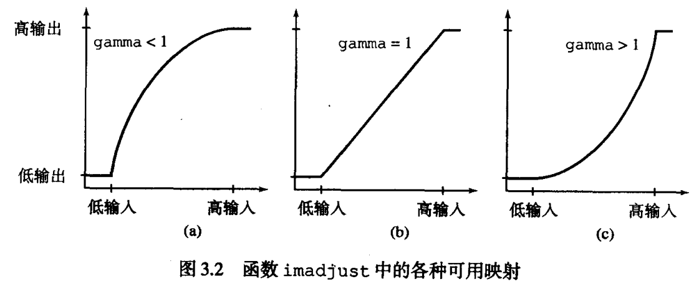
  - 参数 `gamma` 指定曲线的形状，用来映射 f 的亮度值生成图像 g，默认为1（线性映射）
  - 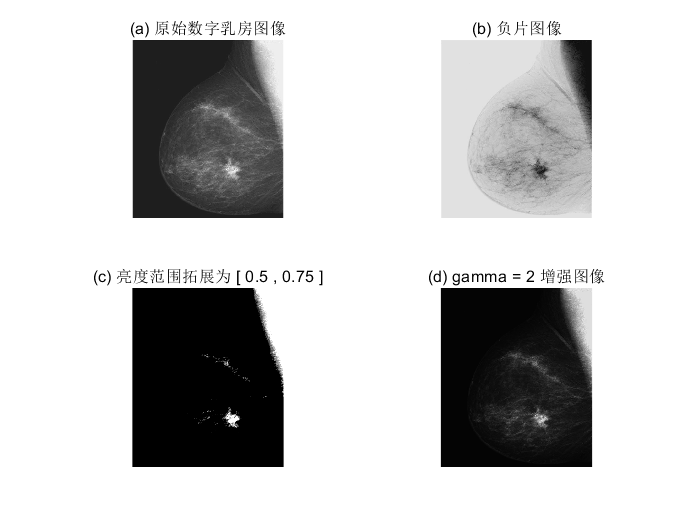

```matlab
% 明暗反转图像（负片图像）
% 增强嵌入在大片黑色区域中的白色/灰色细节
% g = imcomplement(f); 同等效果
g1 = imadjust(f,[0 1],[1 0]);
subplot(2,2,2),imshow(g1),title('(b) 负片图像')
% 突出感兴趣的亮度带 [0.5 0.75]
g2 = imadjust(f,[0.5 0.75],[0 1]);
subplot(2,2,3),imshow(g2),title('(c) 亮度范围拓展为 [ 0.5 , 0.75 ]')
% 压缩灰度级的低端并扩展灰度级的高端 拥有更多灰色调
g3 = imadjust(f,[ ],[ ],2);
subplot(2,2,4),imshow(g3),title('(d) gamma = 2 增强图像')
```

- `对数与对比度拉伸变换` 是进行动态范围处理的基本工具
  - 对数变换表达式：`g = c*log(1 + double(f))`
  - gamma 曲线的形状是可变的，而对数函数形状则是固定的
  - 主要应用：压缩动态范围
    - 期望将导致的压缩值还原为显示的全范围。对8比特而言，最简方法
      - `gs = im2unit8(mat2gray(g))`
  - 对比度拉伸变换函数
    - 将输入值低于m的灰度级压缩为输出图像中较暗灰度级的较窄范围内
    - 阈值函数限制条件下输出二值图像，是进行图形分割的有效工具
    - 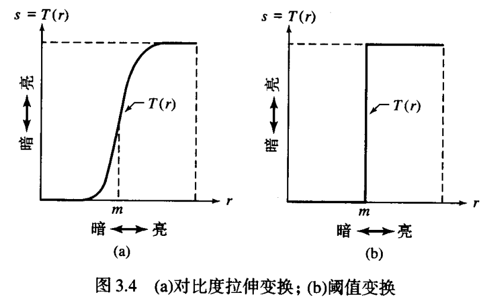
    - 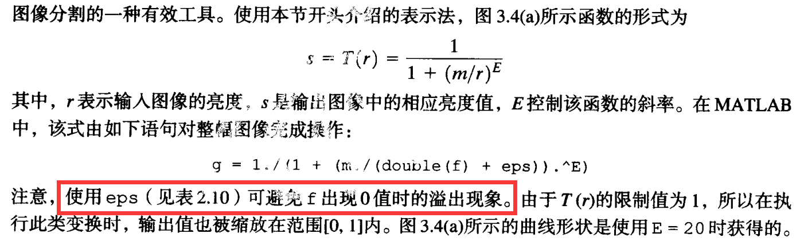
> 对数变换可以扩展图像亮度范围，使得暗部细节更加明显。
- 使用对数变换减小动态范围
  - 
```matlab
f = imread('Fig0305(a)(spectrum).tif');
subplot(1,2,1),imshow(f)
title('(a)在线性比例尺的8比特系统上的傅里叶频谱')
% 确保对数变换后的图像像素值范围在 [0,1] 内
% 将范围在 [0,1] 的图像转换为 8 位无符号整数表示
g = im2uint8(mat2gray(log(1+double(f))));
subplot(1,2,2),imshow(g),title('(b) 执行对数变换后')
```

- 处理可变数量的输入和/或输出
  - 函数 `nargin` 返回输入到 M 函数的参量的实际数目
  - 函数 `nargiout` 返回输入到 M 函数的参量的实际数目
  - 函数 `nargchk` 检测传递的参数数量数目正确性
    - `nargchk(low, high, number)`
    - number小于low时返回消息Not enough input parameters
    - number大于high时返回消息Too many input parameters
    - 介于low与high之间，返回一个空矩阵
    - 示例：`error(nargchk(2, 3, nargin))`
  - 当 `varargin` 用作一个函数的输入变量时，MATLAB会将其置入一个单元数组中，该数组接受由用户输入的变量数

- 函数 `intrans`：负片变换、对数变换、gamma变换和对比度拉伸变换
  - 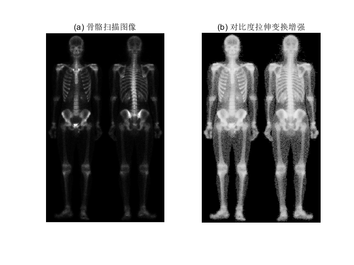

- `changeclass.m` 将输出图像转换回与输入图像相同的数据类型

```matlab
function image = changeclass(class, varargin)
switch class
    case 'uint8'
        image = im2uint8(varargin{:});
    case 'uint16'
        image = im2uint16(varargin{:});
    case 'double'
        image = im2double(varargin{:});
    otherwise
        error('Unsupported IPT data class.');
end
```
- `intrans.m `

```matlab
function g = intrans(f, varargin)
narginchk(2, 4);  % 检查输入参数个数是否符合要求
classin = class(f);  % 获取输入图像的数据类型

method = varargin{1};  % 获取增强方法

if isa(f,'double') && max(f(:)) >1 && strcmp(method, 'log')
    f = mat2gray(f);  % 双精度浮点型并且最大像素值大于1，归一化处理
else
    f = im2double(f);  % 否则，将图像转换为双精度浮点型
end

switch method  % 根据增强方法进行不同的操作
    case 'neg'  % 反转负片
        g = imcomplement(f);
    case 'log'  % 对数变换
        if length(varargin) == 1
            c = 1;
        elseif length(varargin) == 2
            c = varargin{2};
        elseif length(varargin) == 3
            c = varargin{2};
            classin = varargin{3};
        else
            error('Incorrect number of inputs for the log option.')  
        end
        g = c*(log(1+double(f)));  % 进行对数变换
    case 'gamma'  % gamma变换
        if length(varargin)<2
            error('Not enough inputs for the gamma option.')  %
        end
        gam = varargin{2};
        g = imadjust(f, [ ], [ ], gam); 
    case 'stretch'  % 对比度拉伸
        if length(varargin) == 1
            % 计算平均灰度值
            m = mean2(f);
            E = 4.0;
        elseif length(varargin) == 3
            m = varargin{2};
            E = varargin{3};
        else
            error('Incorrect number of inputs for the stretch option.')
        end
        g = 1./(1+ (m./(f + eps)).^E );  % 进行对比度拉伸
    otherwise
        error('Unknown enhancement method.') 
end
g = changeclass(classin, g); 
end
```

```matlab
f = imread('Fig0306(a)(bone-scan-GE).tif');
subplot(1,2,1),imshow(f),title('(a) 骨骼扫描图像')
g = intrans(f, 'stretch', mean2(im2double(f)), 0.9);
subplot(1,2,2),imshow(g),title('(b) 对比度拉伸变换增强')
```

- 函数 `gscale` 把图像标度在全尺度，即最大范围[0,255]或[0,65535]
  - 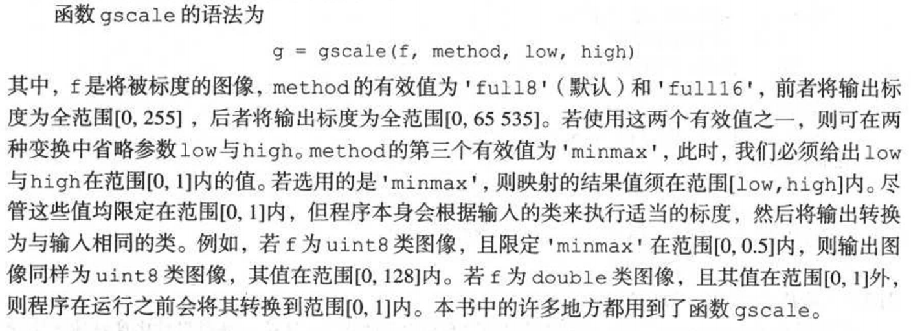

## 3.3 直方图处理与函数绘图

- 生成并绘制图像的直方图
  - 一幅数字图像在范围[0,G]内总共有L个灰度级，其直方图定义为离散函数
  - 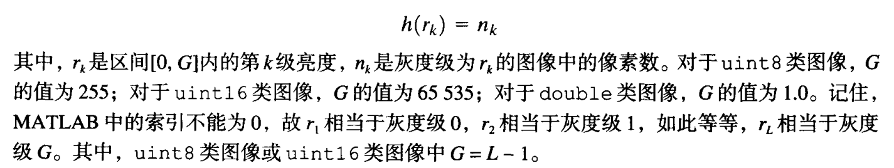
- 归一化直方图
  - 
- `imhist` 函数
  -  
- **计算并绘制图像直方图**
  - 函数 `bar`
    - 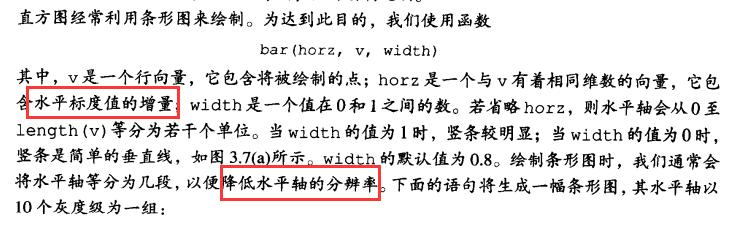
  - 函数 `aixs`
    - 
  - 函数 `stem` 绘制杆状图
    - `stem(horz, v, 'color_linestyle_marker', 'fill')`
  - 参量 `color_linestyle_marker`
    - 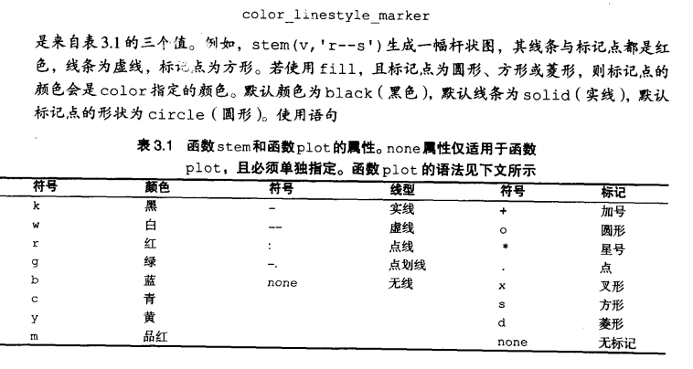
  - 函数 `plot` 将一组点用直线连起来，经常频繁用于显示变换函数
    - `plot(horz, v, 'color_linestyle_marker')`
  - 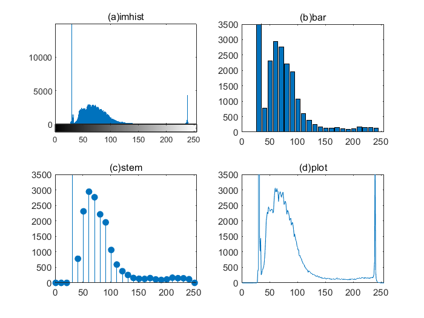
 ```matlab
f = imread('Fig0303(a)(breast).tif');
figure, subplot(2, 2, 1), imhist(f);
title('(a)imhist')
h = imhist(f);h1 = h(1:10:256);
horz = 1:10:256; % 水平轴以10个灰度级为一组
subplot(2, 2, 2), bar(horz, h1);
axis([0 255 0 3500]),title('(b)bar');
set(gca, 'xtick', 0:50:255);
set(gca, 'ytick', 0:500:3500);
subplot(2, 2, 3), stem(horz, h1, 'fill');
axis([0 255 0 3500]),title('(c)stem');
set(gca, 'xtick', [0:50:255]);
set(gca, 'ytick', [0:500:3500]);
subplot(2, 2, 4), plot(h);
axis([0 255 0 3500]),title('(d)plot');
set(gca, 'xtick', [0:50:255]);
set(gca, 'ytick', [0:500:3500]);
 ```

 - **直方图均衡化**
   - 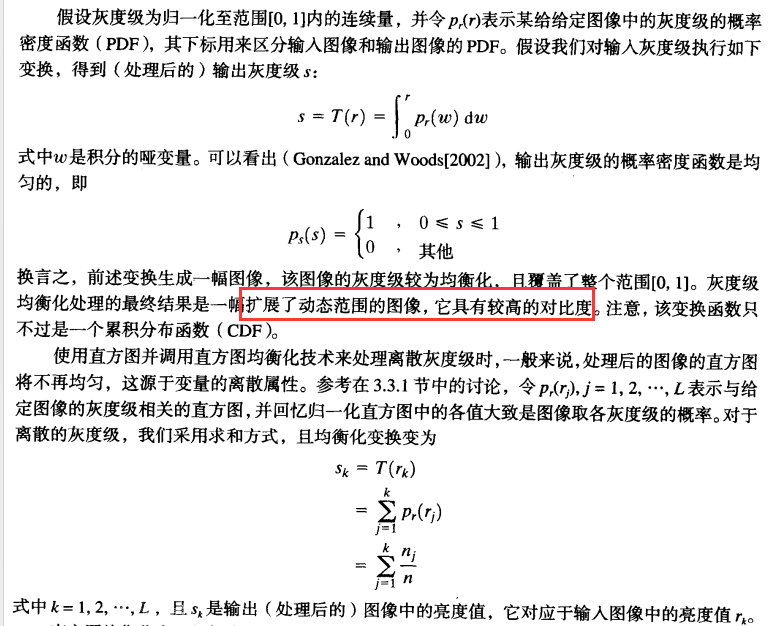
   - 函数 `histeq(f, nlev)`
     - `g = histeq(f, nlev)`
     - 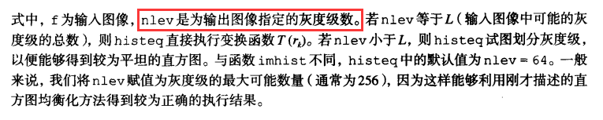
   - 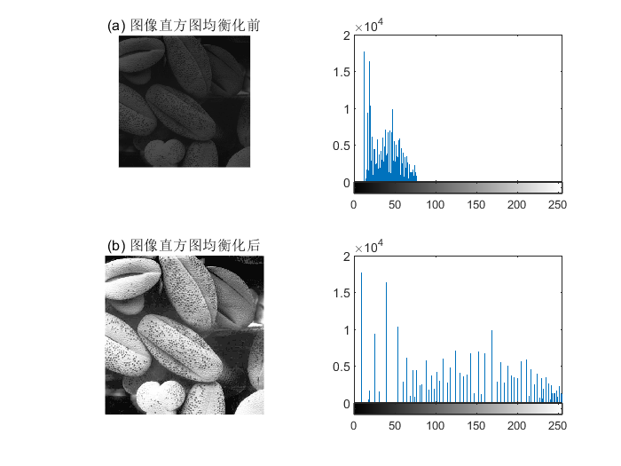
     - 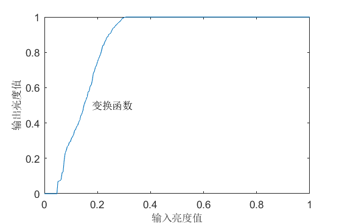
```matlab
f = imread('Fig0308(a)(pollen).tif');
subplot(2,2,1),imshow(f);
title('(a) 图像直方图均衡化前')
ylim('auto'),g=histeq(f, 256);
subplot(2,2,2),imhist(f),ylim('auto');
subplot(2,2,3),imshow(g);
title('(b) 图像直方图均衡化后')
subplot(2,2,4),imhist(g),ylim('auto');
% 变换函数仅是归一化直方图取值的累加
hnorm = imhist(f) ./ numel(f);
cdf = cumsum(hnorm);figure,imshow(cdf);
x = linspace(0, 1, 256);
plot(x,cdf),axis([0 1 0 1])
set(gca, 'xtick', 0:.2:1)
set(gca, 'ytick', 0:.2:1)
xlabel('输入亮度值','fontsize',10)
ylabel('输出亮度值','fontsize',10)
```
- 直方图均衡化通过扩展输入图像的灰度级到较宽亮度尺度的范围来实现图像增强

### 3.3.3 直方图匹配（规定化）

- 生成具有指定直方图的图像的方法称为直方图匹配或直方图规定化
- 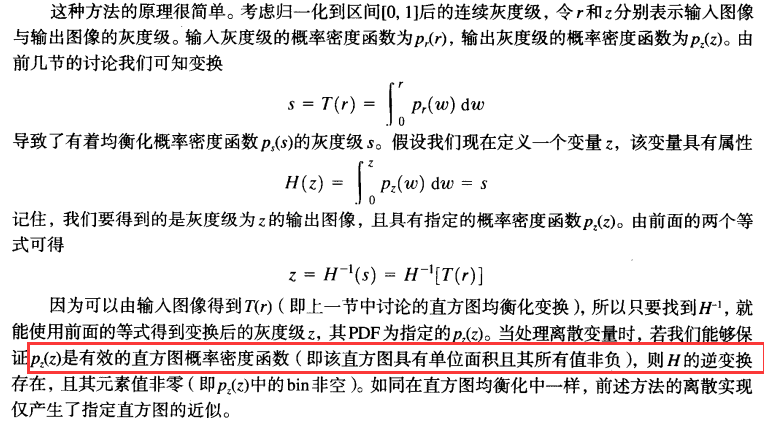
- 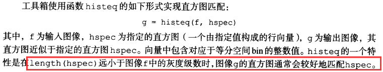
- 计算一个 `已归一化到单位区域的双峰值高斯函数`，以便可将它用做一个指定的直方图
```matlab
function p = twomodegauss(m1, sig1, m2, sig2, A1, A2, k)
% twomodegauss - 生成双峰高斯分布
%   p = twomodegauss(m1, sig1, m2, sig2, A1, A2, k) 生成一个双峰高斯分布，
%   其中 m1 和 m2 是两个峰值的均值，sig1 和 sig2 是两个峰值的标准差，
%   A1 和 A2 是两个峰值的振幅，k 是偏移参数。
%
%   输入参数:
%   - m1: 第一个峰值的均值
%   - sig1: 第一个峰值的标准差
%   - m2: 第二个峰值的均值
%   - sig2: 第二个峰值的标准差
%   - A1: 第一个峰值的振幅
%   - A2: 第二个峰值的振幅
%   - k: 偏移参数
%
%   输出参数:
%   - p: 生成的双峰高斯分布

% 计算第一个峰值的高斯分布部分
c1 = A1 * (1 / ((2 * pi) ^ 0.5) * sig1);
k1 = 2 * (sig1 ^ 2);

% 计算第二个峰值的高斯分布部分
c2 = A2 * (1 / ((2 * pi) ^ 0.5) * sig2);
k2 = 2 * (sig2 ^ 2);

% 生成 0 到 1 之间的等间隔数据点
z = linspace(0, 1, 256);

% 计算双峰高斯分布
p = k + c1 * exp(-((z - m1) .^ 2) ./ k1) + c2 * exp(-((z - m2) .^ 2) ./ k2);

% 归一化，使积分为 1
p = p ./ sum(p(:));
end
```
- `交互式函数` 从键盘读取输入信息，并绘制最终的高斯函数
```matlab
% 定义 manualhist 函数
function p = manualhist
% 初始化 repeats 为真以控制循环
repeats = true;
% 定义退出字符 'x'
quitnow = 'x';
% 使用初始高斯混合模型初始化 p
p = twomodegauss(0.15, 0.05, 0.75, 0.05, 1, 0.07, 0.002);

% 开始输入循环
while repeats
    % 提示用户输入值或输入 'x' 退出
    s = input('请输入 m1、sig1、m2、sig2、A1、A2、k 或 x 退出:', 's');
    % 检查输入是否为 'x' 以退出循环
    if s == quitnow
        break
    end
    % 将输入字符串转换为数字数组
    v = str2num(s);
    % 检查输入是否包含 7 个数字值
    if numel(v) ~= 7
        disp('输入数量不正确。')
        continue
    end
    % 根据用户输入更新 p 的高斯混合模型
    p = twomodegauss(v(1), v(2), v(3), v(4), v(5), v(6), v(7));
    % 创建新图形并绘制更新的高斯混合模型
    figure, plot(p)
    xlim([0 255])
end
```
- 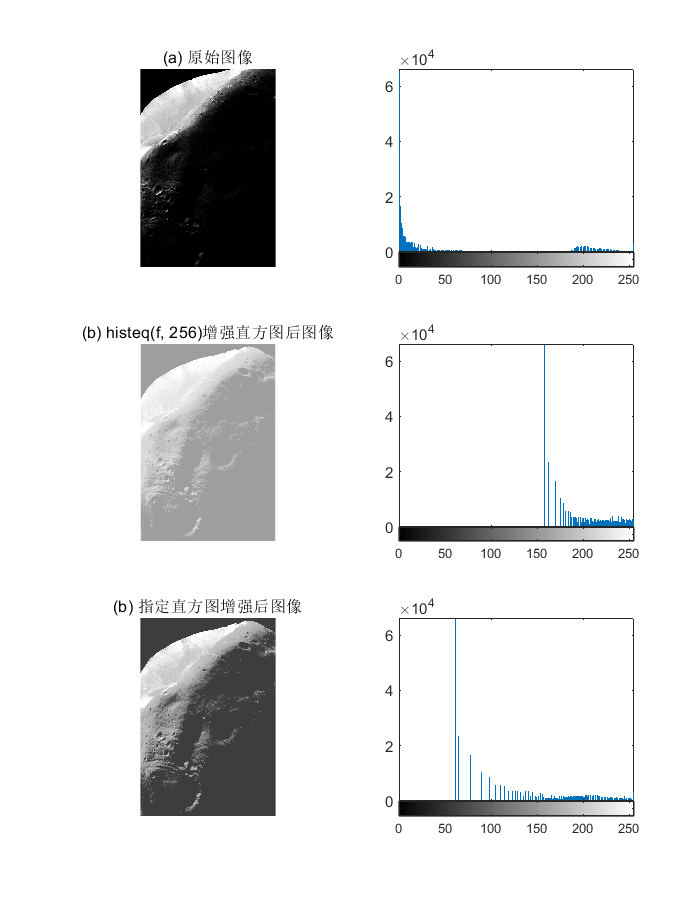
  - 不仅保留了原始直方图的大体形状，而且在图像的较暗区域中灰度级有较为平滑的过渡
  - 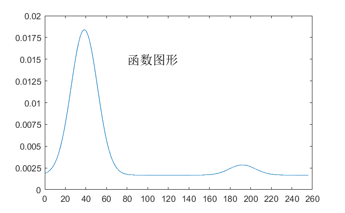
```matlab
f = imread('Fig0310(a)(Moon Phobos).tif');
subplot(3,2,1),imshow(f);
title('(a) 原始图像')
subplot(3,2,2),imhist(f);
g = histeq(f, 256);
subplot(3,2,3),imshow(g);
title('(b) histeq(f, 256)增强直方图后图像')
subplot(3,2,4),imhist(g);
p = twomodegauss(0.15, 0.05, 0.75,0.05 ,1,0.07,0.002);
g = histeq(f, p);
subplot(3,2,5),imshow(g);
title('(b) 指定直方图增强后图像')
subplot(3,2,6),imhist(g);
figure,imshow(p);
x = linspace(0, 256, 256);
plot(x,p),axis([0 260 0 0.02])
set(gca, 'xtick', 0:20:260)
set(gca, 'ytick', 0:.0025:0.02)
text(80,0.015,'函数图形','fontsize',15)
```

## 3.4 空间滤波

- 邻域处理包括：
  1. 定义中心点 `(x,y)`
  2. 仅对预先定义的以 `(x,y)` 为中心点的邻域内的像素进行运算
  3. 令运算结果为该点处处理的响应
  4. 对图像中的每一点重复此步骤
- 用于区别此过程的两种主要术语为 `邻域处理` 和 `空间滤波`

### 3.4.1 线性空间滤波

- 邻域中像素的计算为线性运算时，此运算称为`线性空间滤波（空间卷积）`；否则称为非线性空间滤波
- 线性滤波概念源于频域中信号处理所使用的 `傅里叶变换`
- 区别 `直接对图像中的像素执行滤波运算（线性空间滤波）` 与 `频域滤波`
- 若邻域的大小为 $m×n$，则总共需要 $mn$ 个系数。这些系数排列为一个矩阵，我们称其为 `滤波器、掩模、滤波掩模、核、模板或窗口`，也使用 `卷积滤波` 等术语。
- 所有假设都是基于掩模的大小应均为`奇数`的原则，有意义掩模的最小尺寸是`3×3`
  - 处理奇数尺寸会更加直观，因为它们都有惟一的一个`中心点`
- **相关**
  - 掩模$w$在图像$f$中移动的过程
- **卷积**
  - 从技术上讲，卷积是相同的过程，只是在图像$f$中移动$w$前，要**将$w$旋转180°**
- 
> 这两个函数之间有一些点未重叠。处理这种问题通用方法是在$f$中**填充足够多的零**，以保证$w$在$f$中移动时，总存在相应的点

> 若固定$w$而使$f$在$w$上移动，则结果将会不同，因而**顺序**也是有关系的

- 符号 `full` 与 `same`
  - 
- **离散单位冲击函数**
  - 在某个位置值为1，而在其它位置值为0
  - 卷积基本上只是简单地在冲击的位置复制$w$
  - 这个简单的复制性质（称为`筛选`）是线性系统理论中的一个基本概念，也是其中一个函数总会在卷积中旋转180°的原因
  - 与相关不同的是，颠倒该函数的顺序会产生相同的卷积结果。若函数对称移动，则卷积和相关操作会产生相同的结果
- 
- 函数 `imfilter` 实现线性空间滤波
  - `g = imfilter(f, w, filtering_mode, boundary_options, size_options)`
  - 
  - 
- 卷积计算
  - `g = imfilter(f, w, 'conv', 'replicate')`
  - `rot90(w, 2); imfilter(f, w, 'replicate')`
  - 
- 函数 `imfilter`
  - 
  > 可能因为 MATLAB 的版本原因，这里 `imfilter` 默认的效果并不是模糊边界
  > MATLAB R2018b 不存在 `im2unit8` 函数，此处引用 [m2uint8函数](https://blog.csdn.net/u010875839/article/details/120576716)
  - 

```matlab
f = imread('Fig0315(a)(original_test_pattern).tif');
w = ones(31);
subplot(3,2,1),imshow(f);
title('(a) 512×512 double类图像f')
gd = imfilter(f, w);
subplot(3,2,2),imshow(gd, [ ])
title('(b) 默认的相关处理')
gr = imfilter(f, w, 'replicate');
subplot(3,2,3),imshow(gr, [ ])
title('(c) 选项 replicate 处理')
gs = imfilter(f, w, 'symmetric');
subplot(3,2,4),imshow(gs, [ ])
title('(d) 选项 symmetric 处理')
gc = imfilter(f, w, 'circular');
subplot(3,2,5),imshow(gc, [ ])
title('(e) 选项 circular 处理')
f8 = im2unit8(f);
g8r = imfilter(f8, w, 'replicate');
subplot(3,2,6),imshow(g8r, [ ])
title('(f) 将原图像转换为unit8类图像')
```
### 3.4.2 非线性空间滤波

- `滤波器` 应看做是一个基于邻域像素操作的非线性函数，其响应组成了邻域的中心像素处操作的响应
- 函数 `nlfilter` 和 `colfilt` 执行常规非线性滤波
  - 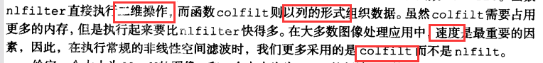
- `g = colfilt(f, [m n], 'sliding', @fun, parameters)`
  - 
  - 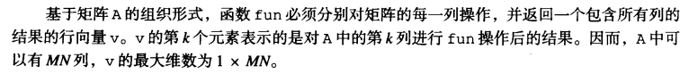
> 符号 @ 称为函数句柄，一种 MATLAB 数据类型，包含有引用函数用到的一些信息
- `fp = padarray(f, [r c], method, direction)`
- 

- **使用函数 confilt 实现非线性空间滤波**
  - 该非线性滤波在任何点处的响应都是中心在该点的邻域内的像素亮度值的 `几何平均`
  - 大小为 $m×n$ 的邻域中的几何平均是邻域内亮度值的乘积的 $1/mn$ 次幂
```matlab
function v = gmean(A)
% 计算矩阵的几何平均值
% 输入参数：
%   A：输入矩阵
% 输出参数：
%   v：行向量，其中每个元素是输入矩阵对应列的几何平均值

mn = size(A, 1);  % 矩阵A的行数，即每列元素个数

% 对每列元素进行累乘，然后开mn次方，得到每列元素的几何平均值
v = prod(A, 1) .^ (1/mn);
end
```
- 为削减边界效应，在函数 `padarray` 中使用 `replicate` 选项来填充输入图像
  - 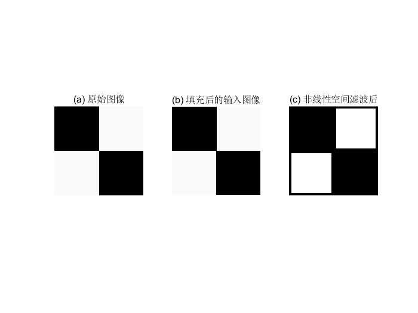
```matlab
f = imread('Fig0315(a)(original_test_pattern).tif');
subplot(1,3,1),imshow(f),title('(a) 原始图像')
m = 31;n = 31;
f = padarray(f, [m n], 'replicate');
subplot(1,3,2),imshow(f),title('(b) 填充后的输入图像')
g = colfilt(f, [m n], 'sliding', @gmean);
subplot(1,3,3),imshow(g),title('(c) 非线性空间滤波后')
```
- 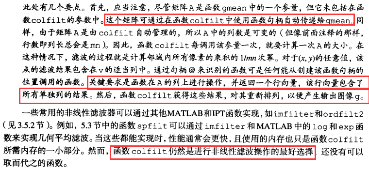

## 3.5 图像处理工具箱的标准空间滤波器

- 由 IPT 支持的线性和非线性滤波技术

### 3.5.1 线性空间滤波器

- 函数 `fspecial` 生成滤波掩模 $w$ 
  - `w = fspecial('type', parameters)`
  - 
  - 
- **使用函数 imfilter**
  - 使用一个 `拉普拉斯滤波器` 来增强一幅图像
  - 由于拉普拉斯算子是微分操作符，所以它会 `使图像锐化`，并使 `常量区域为0`。在原图像中添加黑色会 `还原灰度级色调`
  - 
  - 
  - 
  > 不知道又是不是 MATLAB 的版本原因，图(b) 和 (c) 在视觉上上几乎没有差别。如果我尝试用(a)去减(b)的话，显示不出图片 

```matlab
f = imread('Fig0316(a)(moon).tif');
subplot(2,2,1),imshow(f),title('(a) 原始图像')
% w = fspecial('laplacian', 0);
w = [0 1 0; 1 -4 1; 0 1 0];
g1 = imfilter(f, w, 'replicate');
subplot(2,2,2),imshow(g1),title('(b) 经拉普拉斯滤波后的 unit8 类图像')
f2 = im2double(f);
g2 = imfilter(f2, w, 'replicate');
subplot(2,2,3),imshow(g2),title('(c) 经拉普拉斯滤波后的 double 类图像')
g = f2 - g2;
subplot(2,2,4),imshow(g),title('(d) 从(a)中减去(c)得到结果')
```

- **手工指定滤波器和增强技术的比较**
  - 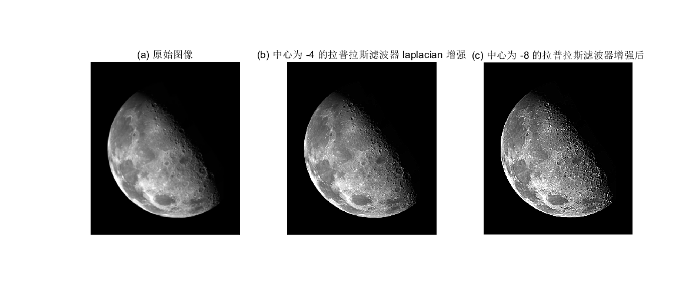

```matlab
f = imread('Fig0316(a)(moon).tif');
subplot(1,3,1),imshow(f),title('(a) 原始图像')
w4 = fspecial('laplacian', 0);
w8 = [1 1 1; 1 -8 1; 1 1 1];
f = im2double(f);
g4 = f - imfilter(f, w4, 'replicate');
subplot(1,3,2),imshow(g4),title('(b) 中心为 -4 的拉普拉斯滤波器 laplacian 增强')
g8 = f - imfilter(f, w8, 'replicate');
subplot(1,3,3),imshow(g8),title('(c) 中心为 -8 的拉普拉斯滤波器增强后')
```

### 3.5.2 非线性空间滤波器

- 函数 `ordfilt2`
  - 生成统计排序（order-statistic）滤波器（也称为排序滤波器，rank filter）
  - 其响应基于对图像邻域中所包含的像素进行排序，然后使用排序结果确定的值来替代邻域中的中心像素的值
  - `g = ordfilt2(f, order, domain)`
  - 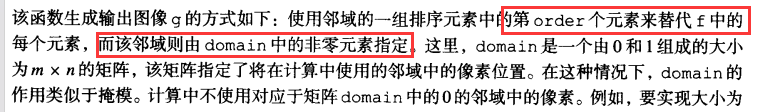
- **中值滤波器**
  - 对应第 50 个百分位
  - `g = ordfilt2(f, median(1:m*n), ones(m, n))`
    - 函数 `v = median(A, dim)` 计算排序序列 `1,2,...,mn` 的中值
    - v是向量，它的元素是A沿着维数dim的中值。例如，若dim=1，则v的每个元素就都是矩阵A中沿相应列的元素的中值
- 二维中值滤波函数 `g = medfilt2(f, [m n], padopt)`
  - 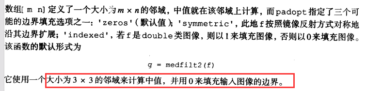
- **使用函数 medfilt2 进行中值滤波**
  - 中值滤波是降低图像 `椒盐噪声` 的有效工具
  - 
  - （c）中的黑色边界效应是由围绕图像的黑点导致的（默认使用0来填充边界），可以通过使用 `symmetric` 选项来减弱

```matlab
f = imread('Fig0318(a)(ckt-board-orig).tif');
subplot(2,2,1),imshow(f),title('(a) X射线图像')
fn = imnoise(f, 'salt & pepper', 0.2);
subplot(2,2,2),imshow(fn),title('(b) 被椒盐噪声污染的图像')
gm = medfilt2(fn);
subplot(2,2,3),imshow(gm),title('(c) 默认设置中值滤波处理后')
gms = medfilt2(fn, 'symmetric');
subplot(2,2,4),imshow(gms),title('(d) 使用 symmetric 选项')
```

> 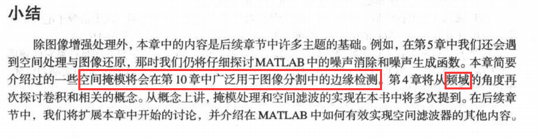