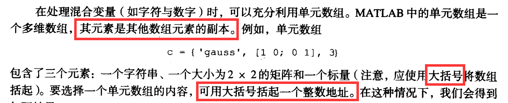

## 第1章 绪言

- 图像处理工具箱称为 `IPT`

> 感想：在已结课课程数字内容安全（95）中的实验已多次使用MATLAB，然而缺乏系统概念的了解，仅仅在临时需要用时寻找对应工具的使用指南，实际上对MATLAB到底是一个什么样的工具没有认知。对于绪言的仔细阅读帮助我对数字图像处理与MATLAB形成了一个整体的印象，有利于我在一个整体的架构上对于图像处理进行学习

## 第2章 基本原理
- 许多为黑白图像处理开发的技术适用于彩色图像处理，方法是分别处理三幅独立的分量图像即可
- `MATLAB` 的图像矩阵原点为 `f(1,1)`
- `[M,N]` 与 `whos`
  -  
- `figure`
  - 
- `imshow(f,[])` 可拉伸图像动态范围
  - 
```matlab
f = imread('Fig0203(a)(chest-xray).tif');
% whos f;
% 获取图片尺寸
imgSize = size(f);
imgWidth = imgSize(2);
imgHeight = imgSize(1);
% 添加注释
x = imgWidth / 2; % 注释框中心点的 x 坐标
y = imgHeight + 50; % 注释框中心点的 y 坐标（图片下方留出一定间距）

subplot(1,2,1);
imshow(f);
str = '(a)拉伸动态范围前的图像f'; % 注释文本内容
text(x, y, str, 'Color', 'black', 'FontSize', 10, 'HorizontalAlignment', 'center');

subplot(1,2,2);
imshow(f,[]);
str = '(b)拉伸动态范围后的图像f'; % 注释文本内容
text(x, y, str, 'Color', 'black', 'FontSize', 10, 'HorizontalAlignment', 'center');
```
- 函数 `imfinfo` 了解所实现的压缩并获得图像文件的其他详细信息
  - 计算压缩比
    - 
  - 使用不同 `jpg质量参数q` 对伪轮廓线进行比较
    - 
```matlab
% 设置不同的压缩质量参数
qualities = [100,50,25,15,5,0];

for i = 1:numel(qualities)
    % 构造保存文件名
    filename = sprintf('compressed_image_q%d.jpg', qualities(i));
    
    % 压缩图像并保存
    imwrite(img, filename, 'jpg', 'Quality', qualities(i));
    % 计算压缩比
    K = imfinfo(filename);
    image_bytes = K.Width*K.Height*K.BitDepth/8;
    compressed_bytes = K.FileSize;
    compression_ratio = image_bytes/compressed_bytes;
    % 显示压缩结果
    subplot(2, 3, i);
    imshow(filename);
    title(['压缩比：', num2str(compression_ratio)]);
end
```
- 
  - 图像无压缩存储：尺寸减小同时像素数不变
    - DPI（Dots Per Inch）改变
    - 由于计算英寸尺寸大小的公式为 `info.Width / info.XResolution` 和 `info.Height / info.YResolution`，而计算 `dpi` 的公式又为 `dpi*英寸/目标英寸`，所以计算压缩分辨率的向量公式可以直接简化为 
      - `res = [round(info1.Width/target_inch(1)),round(info1.Height/target_inch(2))]`
    - 
```matlab
% 读取第一张图片并获取信息
f = imread('Fig0205(a)(cktboard_200dpi).tif');
info1 = imfinfo('Fig0205(a)(cktboard_200dpi).tif');
size1 = [info1.Width, info1.Height];
dpi1 = [info1.XResolution,info1.YResolution];  % 获取第一张图片的DPI

% 设置显示窗口的大小
figure('Units', 'pixels', 'Position', [100, 100, 700, 300]);

% 显示第一张图片
subplot('Position', [0.1, 0.1, size1(1)/dpi1(1)*100/700, size1(2)/dpi1(2)*100/300]);
imshow(f);
title(['Image 1 (',  num2str(dpi1(1)), '×', num2str(dpi1(2)), ' DPI)']);

% 构造压缩向量
target_inch = [1.5,1.5];
res = [round(info1.Width/target_inch(1)),round(info1.Height/target_inch(2))];
imwrite(f,'sf.tif','compression','none','resolution',res);

info2 = imfinfo('sf.tif');
size2 = [info2.Width, info2.Height];
dpi2 = [info2.XResolution,info2.YResolution];  % 获取第二张图片的DPI
% 显示第二张图片
subplot('Position', [0.6, 0.1, size2(1)/dpi2(1)*100/700, size2(2)/dpi2(2)*100/300]);
imshow(f);
title(['Image 2 (', num2str(dpi2(1)), '×', num2str(dpi2(2)),' DPI)']);
```
- 
- 二值图像是一个取值只有0和1的 **逻辑数组**
- 
  - 输入图像使用函数 `double` 而不是函数 `im2double` 来转换为 `double` 类图像，因为若输入是 `unit8` 类图像，函数 `im2double` 会把它们转换到范围 `[0,1]`
- **向量索引**
  - 维数为 1×N 的数组称为行向量
  - 使用转置运算符 `.'` 可将行向量转换为列向量
  - `v(1:3)` 取v的第1-3个元素
  - `v(3:end)` 第3到最后一个元素
  - 若v是一个向量
    - `v(:)` 产生一个列向量
    - `v(1:end)` 产生一个行向量
  - `v(1:2:end)` 从1开始计数，步长为2，直到最后一个元素停止
  - 步长可以为负：`v(end:-2:1)`
  - 
- **矩阵索引**
  - 使用冒号运算符实际上是矩阵或多维数组的一种线性索引形式。事实上，MATLAB将每个数组都作为**列向量**来存储，而不管它实际的维数是多少。这个列由数组列首尾相连而成。
  - 
- 使用数组索引进行简单的图像操作
  - 

```matlab
f = imread('Fig0206(a)(rose-original).tif');
subplot(3,2,1),imshow(f),title('(a)原图像')
% 垂直翻转图像
fp = f(end:-1:1,:);subplot(3,2,2)
imshow(fp),title('(b)垂直翻转图像')
% 截取部分图像
h_st = 257;h_ed = 768;
w_st = 268;w_ed = 757;
fc = f(h_st:h_ed,w_st:w_ed);subplot(3,2,3)
imshow(fc),title('(c)截取部分图像')
% 二次取样图像
step = 20;fs = f(1:step:end,1:step:end);
subplot(3,2,4),imshow(fs),title('(d)二次取样图像')
% 通过图像中部的水平扫描线
% plot(f(size(f,1)/2,:))
col = 512;subplot(3,2,[5 6])
plot(f(col,:)),title('(e)通过图像中部的水平扫描线')
```
- 函数 `ndims`
  - 以任何一个维数来提取某个数组的分量是一个重要的特性
  - 即使是标量，我们也认为它有两个维数，这时的标量是大小为 1×1 的数组
- 
- 
- 
  - 对于向量和矩形数组，两个操作数必须有相同的维数，或者其中一个操作数是标量
- 逻辑运算符既能作用于逻辑数据又能作用于数值数据
- 
- MATLAB 存在很多在变量为true或false时，根据数值或条件返回逻辑1或0的函数
- 
- 科学计数法使用字母e来表示10的幂次。虚数使用i或j作为后缀。
- 浮点数的精度有限，一般到小数点后16位数字，范围有限，大约为 $10^{-308} \sim 10^{308}$
- **流控制**
  - 当 `if` 语句嵌套时，每个 `if` 都必须与一个相应的 `end` 配对
  - 函数 `error` 将终止程序的执行并且输出括号内的信息（引号不能省略）
  - `length(A)` 返回数组A的最长维的大小
  - 函数 `numel` 直接获得数组中的元素个数
  - 
  - 
  - 
- **代码优化**
  > MATLAB数组不能有0索引
  - **向量化循环**
    - 将 `for` 循环和 `while` 循环转换为等价的向量或矩阵运算
    - 
    - 
    - 以生成二维正弦图像函数为例测试
    - 
- `twodsin.m` 文件：*（仅展示部分代码）*
  - 加快代码执行时间的另一种方法是在程序中 **预分配数组** 的大小
```matlab
function [rt, f, g,t1,t2] = twodsin(A, u0, v0, M, N)
tic

% 预分配内存并初始化 f
f = zeros(M, N);

for r = 1:M
    u0x = u0 * (r-1);
    for c = 1:N
        v0y = v0 * (c-1);
        f(r, c) = A * sin(u0x + v0y);
    end
end

t1 = toc;tic
r = 0:M-1;c = 0:N-1;
[C, R] = meshgrid(c, r);
g = A * sin(u0 * R + v0 * C);
t2 = toc;

rt = t1 / (t2 + eps);
end
```
```matlab
[rt,f,g,t1,t2] = twodsin(1,1/(4*pi),1/(4*pi),512,512);% disp(rt);

f = mat2gray(f);subplot(1,2,1),imshow(f)
s1 = num2str(t1);s2 = num2str(t2);
title(['(a)由for循环生成: ',s1,'s'])
g = mat2gray(g);subplot(1,2,2),imshow(g)
title(['(b)由向量循环生成: ',s2,'s'])

annotation('textbox', [0.45, 0.18, 0.1, 0.1], 
'String', ['由(a)(b)知向量循环比 for 循环快了 ' num2str(rt) ' 倍'], 
'HorizontalAlignment', 'center', 'EdgeColor', 'none');
```
- **交互式I/O**
  - 
- **单元数组与结构**
  - 
  - 包含的是**参量的副本**，而不是指向该参量的指针
  - 单元数组中的单元由数字寻址，而结构的元素由域来寻址


> 感想：基于其它编程语言的学习经验（C/C++，Python等），再加上ACM竞赛的算法经验，上手理解这些命令并不困难。在所有有进行图像处理的示例中，我均自己重新编写并在matlab中运行程序，输出图像，尝试自行拓展，以求理解深入。