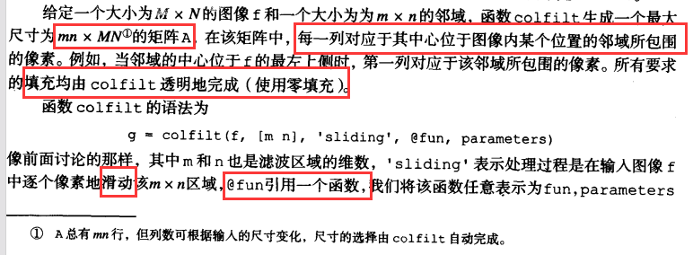

## 第3章 亮度变换与空间滤波

- 空间滤波有时称为领域处理或空间卷积
- 空间域处理务必注意数据类和取值范围
- 当处理单色（灰度）图像时，亮度和灰度两个术语可以互相换用；当处理彩色图像时，**亮度**用来表示某个色彩空间中的一个彩色图像分量
- 函数 `imadjust`
  - 对灰度图像进行亮度变换的基本IPT工具
  - 
  - 参数 `gamma` 指定曲线的形状，用来映射 f 的亮度值生成图像 g，默认为1（线性映射）