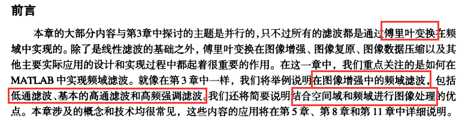
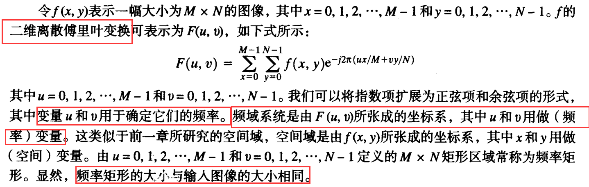

# 第4章 频域处理

- 

## 4.1 二维离散傅里叶变换

- 

## 4.2 在 MATLAB 中计算并可视化二维 DFT

## 4.3 频域滤波

### 4.3.1 基本概念

### 4.3.2 DFT 滤波的基本步骤

### 4.3.1 用于频域滤波的 M 函数

## 4.4 从空间滤波器获得频域滤波器

## 4.5 在频域中直接生成滤波器

### 4.5.1 建立用于实现频域滤波器的网络数组

### 4.5.2 低通频域滤波器

### 4.5.3 线框图与表面图

## 4.6 锐化频域滤波器

### 4.6.1 基本的高通滤波器

### 4.6.2 高频强调滤波